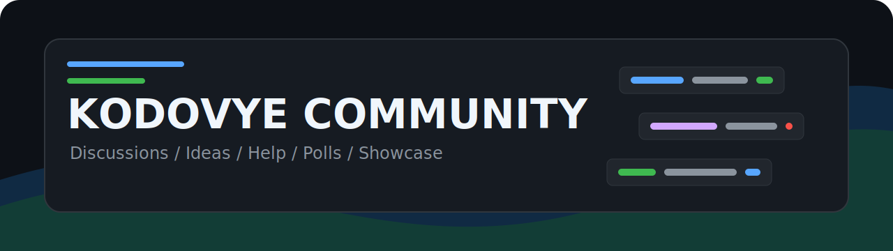

  

  
  
  

  <strong>Kodovye Community</strong> - место для общения, идей, вопросов, голосований и показов работ.

---

## Быстрый Вход

| Хочешь | Куда идти | Как писать |
| --- | --- | --- |
| Просто поговорить | [General](https://github.com/kodovye/community/discussions/categories/general) | короткая тема, свободный формат |
| Предложить идею | [Ideas](https://github.com/kodovye/community/discussions/categories/ideas) | что делаем, зачем, первый шаг |
| Получить помощь | [Q&A](https://github.com/kodovye/community/discussions/categories/q-a) | вопрос, контекст, что уже пробовал |
| Провести выбор | [Polls](https://github.com/kodovye/community/discussions/categories/polls) | один вопрос, 2-5 вариантов, срок |
| Показать работу | [Show and tell](https://github.com/kodovye/community/discussions/categories/show-and-tell) | что сделал, ссылка/скрин, какой фидбек нужен |
| Узнать важное | [Announcements](https://github.com/kodovye/community/discussions/categories/announcements) | новости и решения от команды |

## Стартовые Комнаты

<table>
  <tr>
    <td width="50%">
      <h3>Lobby</h3>
      
Для коротких разговоров, знакомства, идей на лету и обычного движения клуба.

      
<a href="https://github.com/kodovye/community/discussions/2">Открыть общий чат</a>

    </td>
    <td width="50%">
      <h3>Workshop</h3>
      
Для вопросов, помощи, разборов, технических тем и поиска конкретного ответа.

      
<a href="https://github.com/kodovye/community/discussions/4">Задать вопрос</a>

    </td>
  </tr>
  <tr>
    <td width="50%">
      <h3>Ideas Board</h3>
      
Для предложений, улучшений, новых активностей и решений, которые можно обсудить.

      
<a href="https://github.com/kodovye/community/discussions/3">Предложить идею</a>

    </td>
    <td width="50%">
      <h3>Showcase</h3>
      
Для демо, скринов, репозиториев, прогресса и всего, что хочется показать людям.

      
<a href="https://github.com/kodovye/community/discussions/5">Показать работу</a>

    </td>
  </tr>
</table>

## Как Здесь Общаться

1. Выбирай подходящую категорию.
2. Пиши заголовок так, чтобы тему можно было найти через месяц.
3. Вопросы оформляй с контекстом, а идеи - с пользой и первым шагом.
4. Не публикуй токены, приватные переписки, чужие данные и материалы без разрешения.
5. Держи тон нормальным: жесткая критика решения допустима, личные наезды нет.

## Для Участников Kodovye

Внутренние права, роли, порядок доступа и закрытые правила лежат отдельно в приватном репозитории:

[kodovye/members](https://github.com/kodovye/members)

Если ты участник организации и не видишь этот репозиторий, попроси `xirnu` или `Pomidor8639` проверить доступ к team `Clan`.

## Ссылки

| Раздел | Ссылка |
| --- | --- |
| Все обсуждения | [community/discussions](https://github.com/kodovye/community/discussions) |
| Правила публичного общения | [CODE_OF_CONDUCT.md](./CODE_OF_CONDUCT.md) |
| Как просить помощь | [SUPPORT.md](./SUPPORT.md) |
| Публичная схема клуба | [GOVERNANCE.md](./GOVERNANCE.md) |
